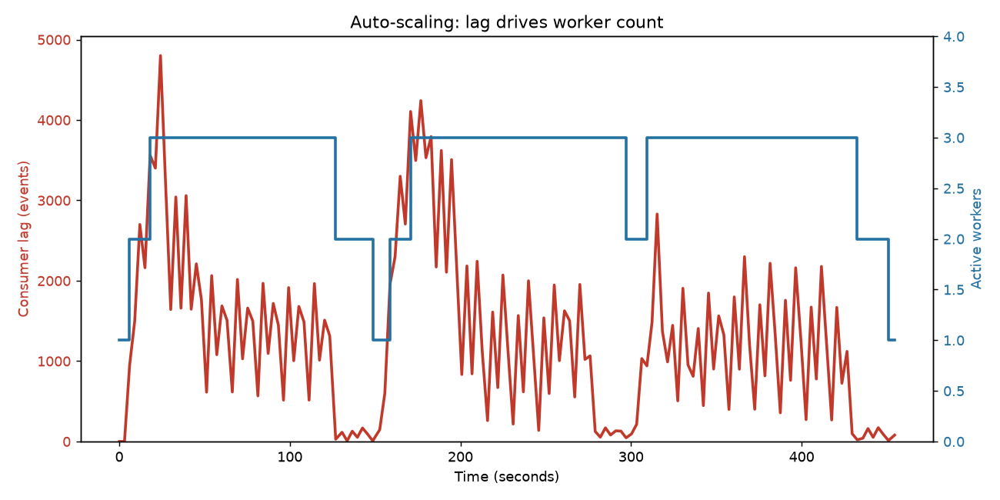
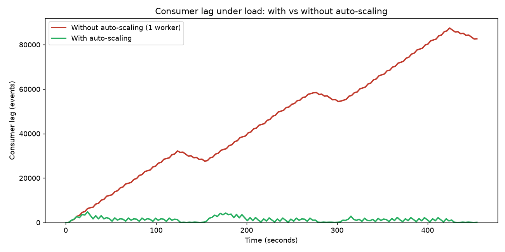
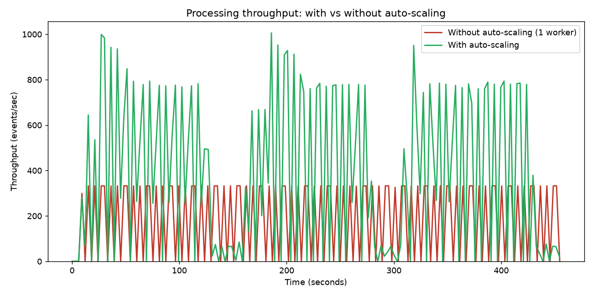

# Real-Time Scalable Event Processing System with Auto-Scaling Simulation

M.Tech Major Project — Piyush Kumar (M25DE1046)
Supervisor: Shubhash Bhagat
School of Artificial Intelligence & Data Science, IIT Jodhpur

## Overview

Ticket-booking platforms (BookMyShow and similar) face sudden 10x–100x traffic
spikes when a popular event opens. This project simulates that surge, streams
booking events through Apache Kafka, processes them with a pool of consumer
workers, and runs a lag-based auto-scaler that adds or removes workers as the
backlog grows and shrinks — keeping latency under control automatically.

    Producer  ->  Kafka (booking-events, 3 partitions)  ->  Consumer group  ->  Auto-scaler
    (surge        (KRaft mode, no Zookeeper)                (worker pool)        (resizes the
     simulator)                                                                   pool by lag)

The auto-scaler is the core contribution: it reads consumer-group lag directly
from Kafka and spawns/kills workers on threshold crossings, with a cooldown to
prevent flapping and a worker ceiling tied to partition count.

## Results

Two passes against the same load (see run_demo.sh), reset to zero lag between
passes for a fair comparison:

- Without auto-scaling (1 fixed worker): the backlog grows unbounded, reaching
  ~87,000 events of consumer lag and never recovering.
- With auto-scaling: lag stays near zero, and throughput sustains ~800-1000
  events/sec during surges — roughly 3x the single-worker ceiling of ~330
  events/sec.

Under repeating surges, workers scale 1 -> 2 -> 3 as lag rises and back to 1 as
it clears, entirely automatically.

Result graphs are in docs/results/:

## Components

- producer/data_generator.py — booking-event simulator. Emits a realistic
  session funnel (search -> view -> select_seat -> ... -> booking) with
  per-session context, keyed by session_id (the Kafka partition key). Three
  load profiles: steps, curve (Gaussian surge), and cycles (repeating surges).
- consumer/consumer.py — a worker. Joins the booking-workers consumer group,
  simulates ~5 ms of work per event, and reports throughput and per-interval
  latency. The unit the scaler starts and stops.
- scaler/auto_scaler.py — the auto-scaler. Reads lag via one persistent Kafka
  connection (no per-poll JVM overhead), decides using configurable
  thresholds, launches/stops workers as subprocesses, and logs metrics to CSV.
  --no-scale gives a fixed-1-worker baseline.
- plot_metrics.py — turns metrics CSVs into the comparison graphs.
- run_demo.sh — runs a baseline pass and an auto-scaling pass against the same
  load, generates graphs, and keeps the last 3 runs.
- config/settings.py — every tunable in one place.
- docs/ — the project presentation and result graphs.

## How the auto-scaler works

A control loop every 3 seconds: measure -> decide -> act -> cool down.

    lag = sum ( log_end_offset - committed_offset )    # over all partitions
                                                       # = events produced but not yet processed

    every 3s:
        lag = read_lag()
        if lag > 300 and workers < 3:   spawn_worker()
        elif lag < 50 and workers > 1:  kill_worker()
        sleep(10s)                                     # cooldown, prevents flapping

Lag is read in-process through a single persistent connection, so there is no
JVM launched per poll. The scaling signal (consumer-group lag) and the min/max
bounds (tied to partition count) mirror how production systems such as KEDA
scale Kafka consumers.

## Environment and hardware constraints (changes from the proposal)

The proposal specified Docker (Confluent Kafka + Zookeeper) plus Prometheus and
Grafana. On the actual development machine — a Lenovo IdeaPad 330, Intel Core
i3-8130U (2 cores / 4 threads), 4 GB RAM, no GPU, Windows 11 — that stack was
not workable: two JVMs plus Docker's WSL2 VM demand ~6 GB on a 4 GB machine, so
it swapped constantly and locked up under load. The changes made, all
documented as engineering decisions rather than shortcuts:

- Dropped Docker; installed natively inside WSL2. Removes the Docker VM
  overhead. Containerization is kept as the documented cloud-deployment path.
- Dropped Zookeeper; Kafka runs in KRaft mode. One fewer JVM; still Apache
  Kafka, same client API.
- Capped the broker heap at 512 MB so it coexists with the Python processes.
- Replaced Prometheus + Grafana with CSV logging + matplotlib. Same graphs, a
  fraction of the memory.
- Kept Apache Kafka — the core streaming technology, unchanged.

## Load levels and the two ceilings

Two limits shape the numbers; the lower one governs. The producer tops out
around 1100-1300 msg/s on this machine (single-threaded JSON serialization).
Each worker does ~200 events/s (5 ms/event), and with 3 partitions at most 3
workers run in parallel — a ceiling of ~600 events/s. That processing ceiling
is lower, so the surge peak is set to 500 msg/s over a 40 msg/s baseline (a
12.5x spike): high enough to bury one worker, low enough that three fully
absorb it, so the demo resolves cleanly. Every limit here is a config value —
handling more load is a config change, not a redesign, up to the hardware
limit; beyond that the design scales horizontally, as Kafka does in
production.

## Setup (native, no Docker)

Prerequisites: WSL2 + Ubuntu, Java 17, Python 3.

    # Kafka (KRaft) - first-time storage format
    cd ~/kafka
    export KAFKA_HEAP_OPTS="-Xmx512m -Xms512m"
    KAFKA_CLUSTER_ID="$(bin/kafka-storage.sh random-uuid)"
    bin/kafka-storage.sh format --standalone -t "$KAFKA_CLUSTER_ID" -c config/server.properties
    bin/kafka-server-start.sh config/server.properties          # leave running

    # Topic (new terminal)
    bin/kafka-topics.sh --create --topic booking-events \
      --partitions 3 --replication-factor 1 --bootstrap-server localhost:9092

    # Python env
    cd ~/realtime-event-processing-system
    python3 -m venv venv && source venv/bin/activate
    pip install kafka-python-ng psutil pandas matplotlib

## Running

    # Full automated demo: baseline + auto-scaling + graphs (keeps last 3 runs)
    ./run_demo.sh              # short cycles (~5-6 min)
    ./run_demo.sh --full       # full-length cycles (~15 min)

    # Or run pieces manually:
    python scaler/auto_scaler.py                    # auto-scaling (starts 1 worker, scales as needed)
    python scaler/auto_scaler.py --no-scale         # baseline (1 fixed worker)
    python producer/data_generator.py --mode cycles # repeating surges

Metrics land in metrics/runs/run_<timestamp>/ as CSVs and graphs.

## Tech stack

Apache Kafka 4.3.1 (KRaft) · Java 17 · Python 3 · kafka-python-ng · psutil ·
pandas · matplotlib · WSL2 / Ubuntu

## Future scope

- Containerize and deploy on AWS / GCP (Docker/Kubernetes belong here)
- Predictive (ML-based) scaling that reacts ahead of surges
- Multi-tenant event categories and queues
